# Swift Charts Examples
This repo aims to provide sample code for lots of different chart types for you to use as inspiration for your own projects. We start by recreating the sample charts Apple uses in their sessions related to Swift Charts. The goal is to make each chart type customizable, accessible and flexible so that you can easily change it to your needs.

## Todo
- [ ] Other Charts
- [ ] Multi-language Support
- [ ] Screen time like bar chart with stacked colors
- [ ] First row, second bar with the lines with blocks in the middle
- [ ] Sleep stages chart
- [ ] iPhone battery percentage screen with different colors and overlaid bar
- [ ] Make all charts accessible

See the [open issues](https://github.com/jordibruin/SwiftChartExamples/issues) if you think anything is missing from this list. You can also contact me on [Twitter](https://www.twitter.com/jordibruin) if you have any suggestions or feedback.

## How to add a new chart

Each chart needs a preview chart as well as a detail view. The preview chart is used in the home screen of the app for easier navigation. Look at the Simple Line Chart code to see what the format should be for the preview charts. On the detail view, make sure you add some customisation options in a separate section from the chart. If you have any questions feel free to create an [issue](https://github.com/jordibruin/SwiftChartExamples/issues).

Source: https://developer.apple.com/videos/play/wwdc2022/10137/

## Chart Types

### [Line Charts](https://github.com/jordibruin/SwiftChartExamples/tree/main/Swift%20Charts%20Examples/Charts/LineCharts)

Line Chart

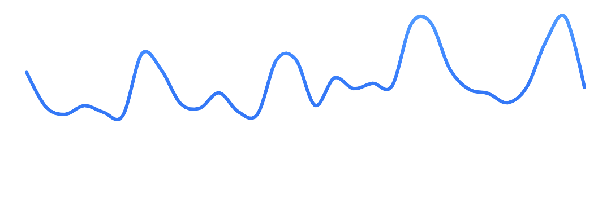

Line Chart with Lollipop

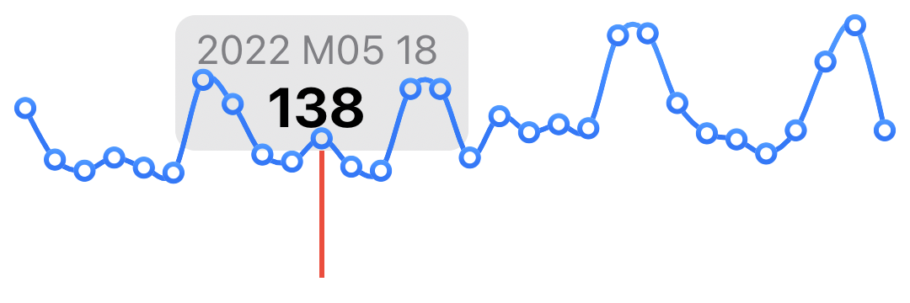

Heart Beat / ECG Chart

Animating Line

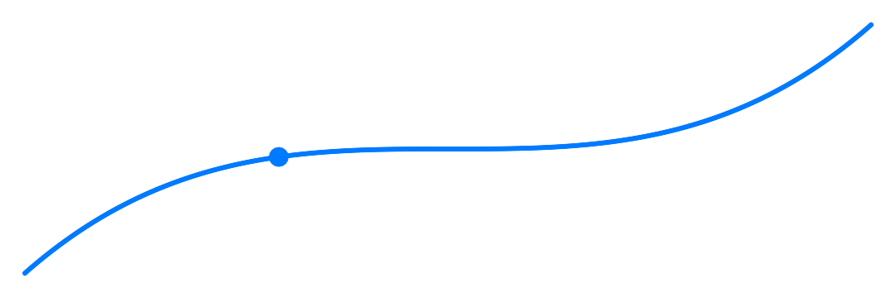

Line with changing gradient

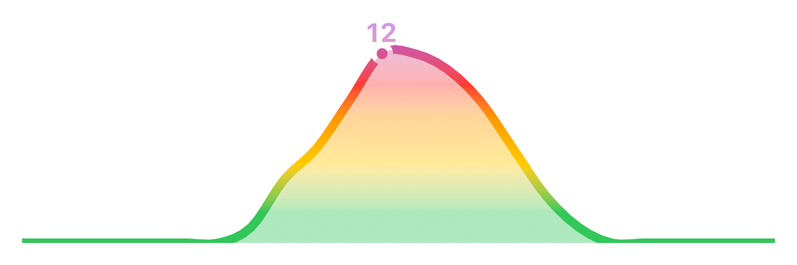

Line Charts

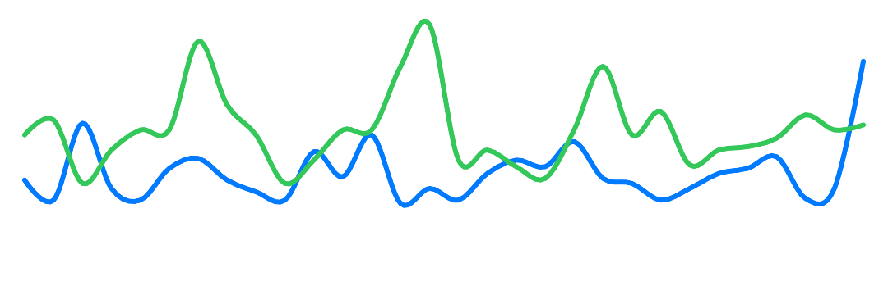

Line Point

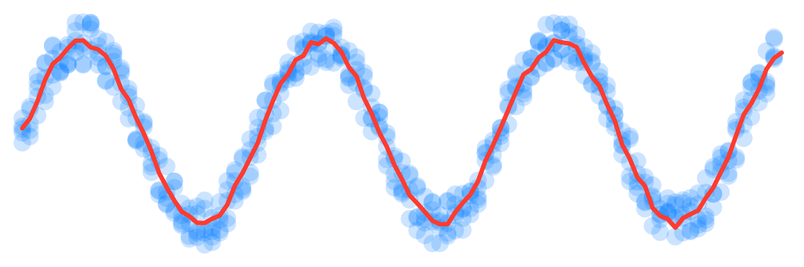

### [Bar Charts](https://github.com/jordibruin/SwiftChartExamples/tree/main/Swift%20Charts%20Examples/Charts/BarCharts)

Single Bar

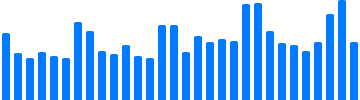

Single Bar with Threshold Rule Mark

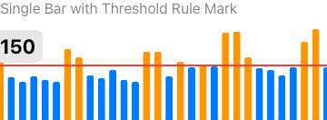

Two Bars

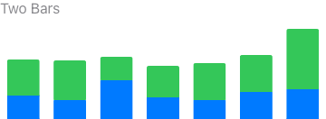

Pyramid

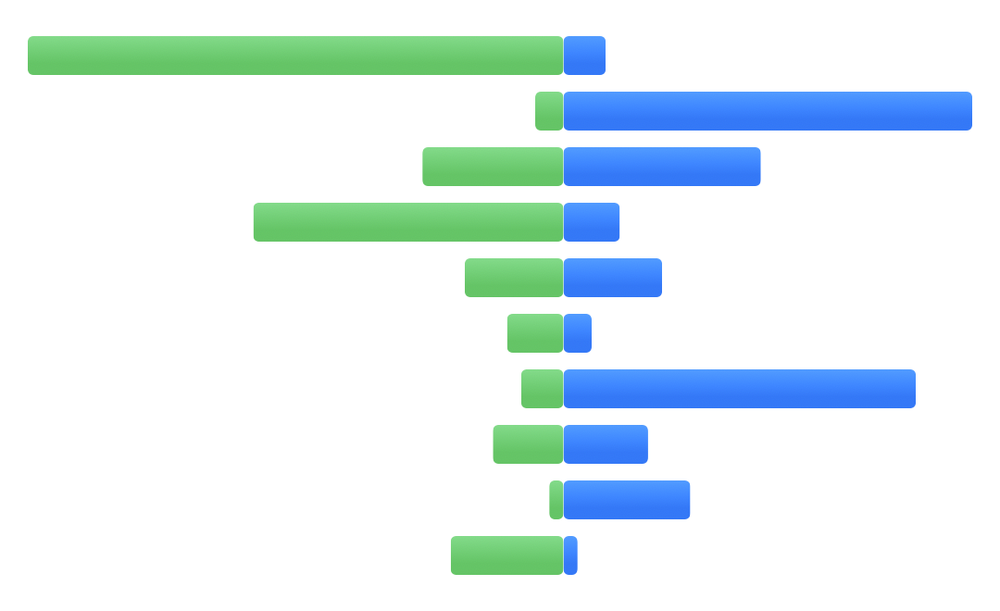

One Dimensional Bar

Time Sheet Bar

Sound Bar

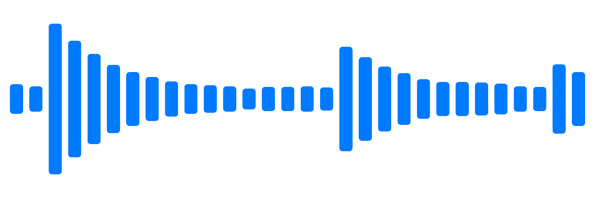

### [Area Charts](https://github.com/jordibruin/SwiftChartExamples/tree/main/Swift%20Charts%20Examples/Charts/AreaCharts)

Area Chart

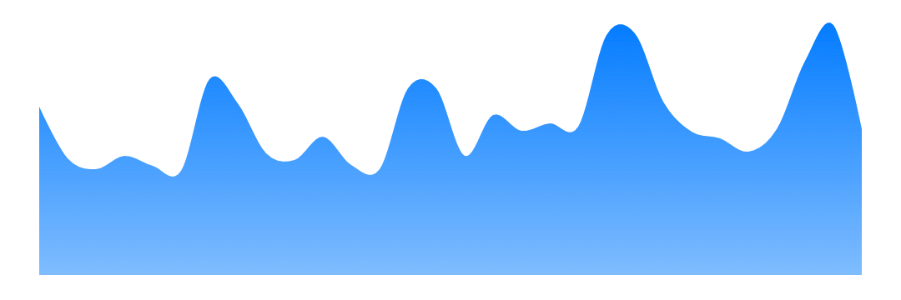

Stacked Area Chart

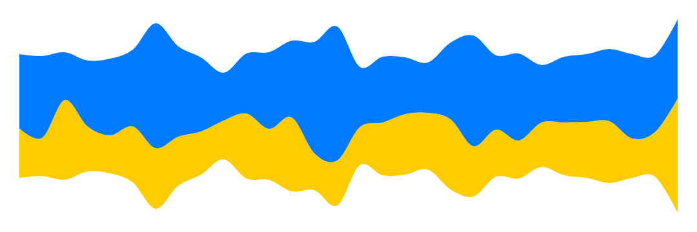

### [Range Charts](https://github.com/jordibruin/SwiftChartExamples/tree/main/Swift%20Charts%20Examples/Charts/RangeCharts)

Range Chart

Heart Rate Range Chart

Candle Stick Chart

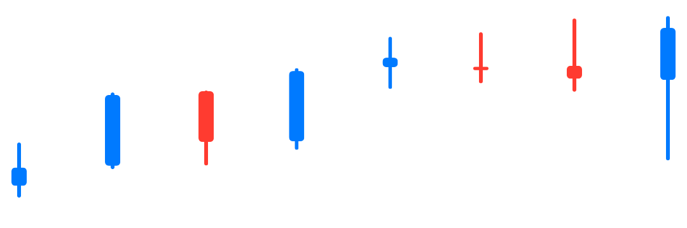

### [Heat Maps](https://github.com/jordibruin/SwiftChartExamples/tree/main/Swift%20Charts%20Examples/Charts/HeatMap)

Customizable Heat Map

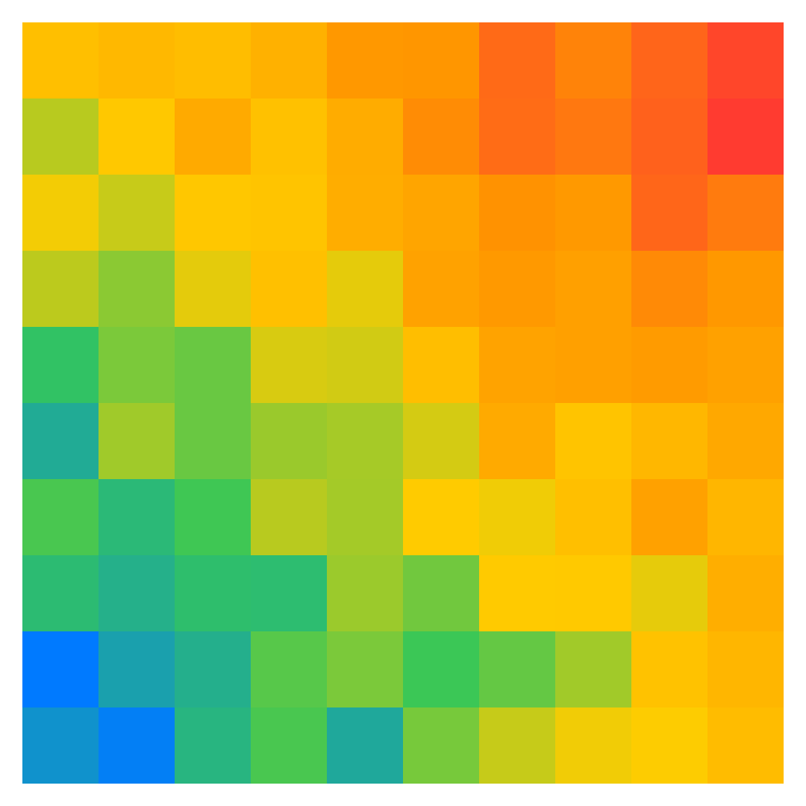

GitHub Contributions Graph

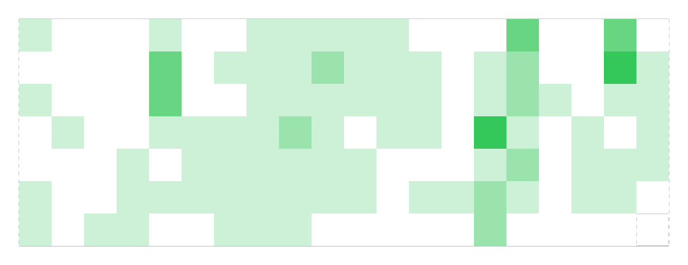

### [Point Charts](https://github.com/jordibruin/SwiftChartExamples/tree/main/Swift%20Charts%20Examples/Charts/PointCharts)

Scatter Chart

Vector Field

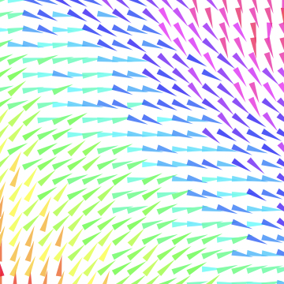

